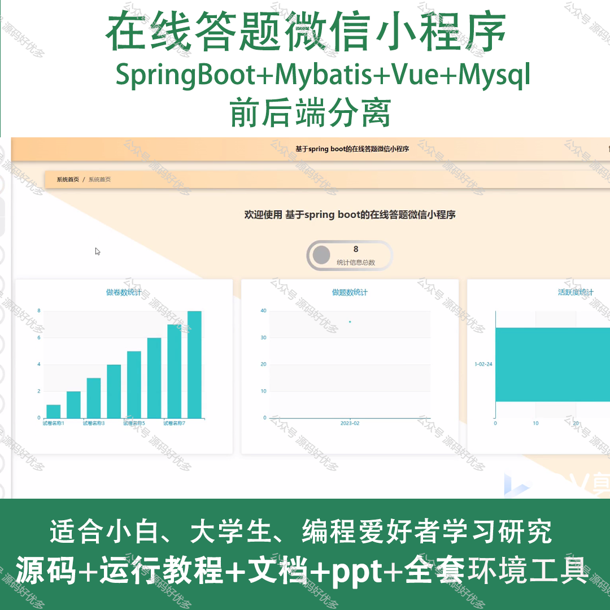
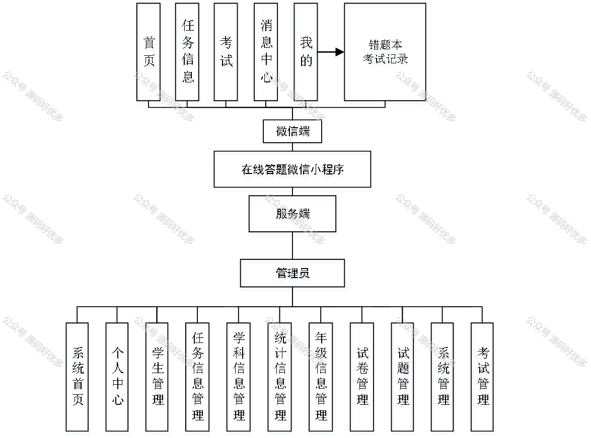
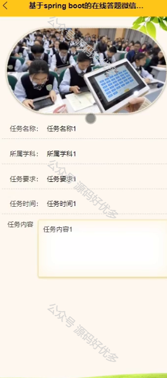
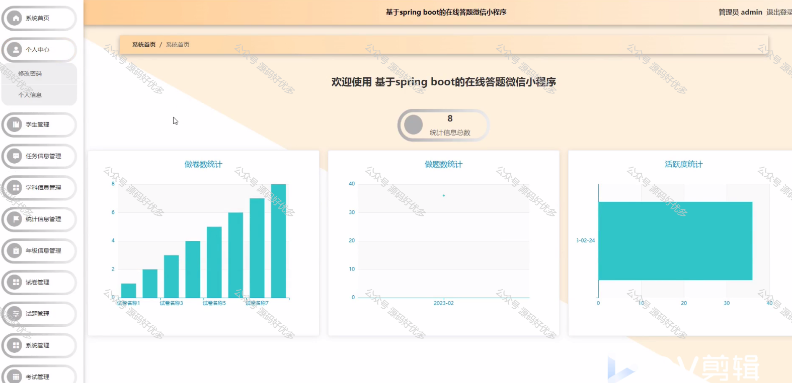
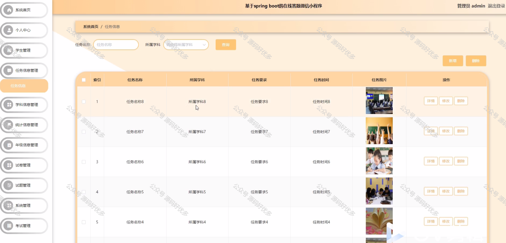
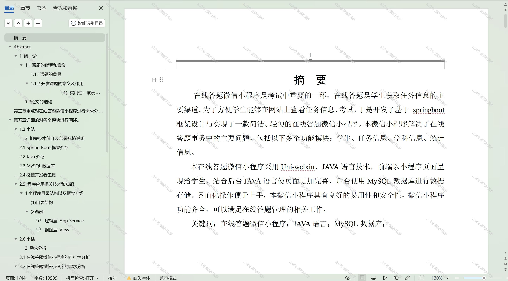

 
## 查看主页获取源码

> **作者介绍**： **✌**全网粉丝10W+本平台特邀作者、博客专家、CSDN新星计划导师、java领域优质创作者,博客之星、掘金/华为云/阿里云/InfoQ等平台优质作者、专注于项目实战 **✌**

  

### 一、作品包含

源码+数据库+设计文档万字+PPT+全套环境和工具资源+部署教程

### 二、项目技术

前端技术：Html、Css、Js、Vue、Element-ui

数据库：MySQL

后端技术：Java、Spring Boot、MyBatis

  

### 三、运行环境

开发工具：IDEA/eclipse + 微信开发者工具

数据库：MySQL5.7

数据库管理工具：Navicat10以上版本

环境配置软件： JDK1.8+Maven3.6.3

前端Nodejs：14

### 四、项目介绍
项目编号：mpweixinA050

在线答题微信小程序，是一款集知识性、趣味性于一体的学习工具，它以简洁优雅的界面和丰富多样的题目库，为用户提供了一个随时随地可以进行智力挑战的平台。从小学生到职场人士，都能在这里找到适合自己的知识领域，通过答题来锻炼思维、拓展视野，让学习变得更加轻松有趣，让知识的力量伴随每一次指尖的滑动。

前台用户功能：首页、任务信息、考试、消息中心、错题本和考试记录。

后台管理员的功能：系统首页、个人中心、学生管理、任务信息管理、学科信息管理、统计信息管理、年级信息管理、试卷管理、试题管理和系统管理、考试管理。
### 五、运行截图

  
